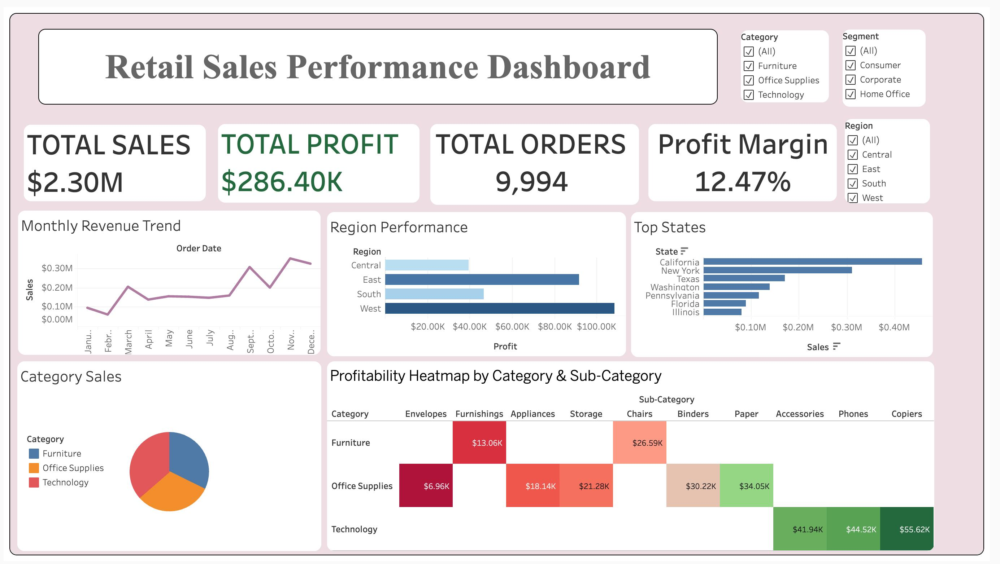

#  Hopper Horizon: Retail Sales Analytics Dashboard

> **Newton School of Technology | Data Visualization & Analytics Capstone**  
> A comprehensive 2-week industry simulation converting raw transactional retail data into actionable business intelligence using Python, Tableau, and Statistical Modeling.

---

## 📖 Project Overview

| Field | Details |
| :--- | :--- |
| **Project Title** | Hopper Horizon: Retail Sales Analytics |
| **Sector** | Global Retail & E-commerce |
| **Team ID** | DVA-T05 |
| **Submission Date** | April 2026 |
| **Tech Stack** | Python (Pandas, Seaborn, Scikit-Learn), Tableau Public |

### Team Members
| Role | Name | GitHub |
| :--- | :--- | :--- |
| **Project Lead** | Divya Pahuja | [divyapahuja](https://github.com/divyapahuja) |
| **Data Lead** | Krit Garg | [kritgarg](https://github.com/kritgarg) |
| **ETL Lead** | Deepak Pathik | [deepakpathik](https://github.com/deepakpathik) |
| **Analysis Lead** | Nitya Jain | [curiouscoder-cmd](https://github.com/curiouscoder-cmd) |
| **Visualization Lead** | Harsh Hirawat | [GreenHacker420](https://github.com/GreenHacker420) |

---

##  Business Problem
In the modern retail landscape, raw data is abundant but insights are rare. Leadership at Hopper Horizon required a unified view of **revenue trends, regional profitability, and product performance** to optimize inventory and pricing strategies.

### Core Business Question
> **"Which product categories and geographical regions should be prioritized to maximize both top-line growth and bottom-line profitability?"**

---

##  Tech Stack & Tools
<p align="left">
  
  
  
  
  
</p>

---

##  Key Insights (Data-Driven)

Through rigorous Exploratory Data Analysis (EDA) and Statistical Testing, we uncovered several critical business drivers:

1.  **Discounting Pitfalls**: A **strong negative correlation (-0.22)** was identified between discounts and profit. Aggressive promotional strategies are currently eroding net margins faster than they drive volume.
2.  **Sales vs. Profit**: While there is a **moderate positive correlation (0.48)** between sales and profit, the variance suggests that high-volume orders do not always translate to high profitability.
3.  **Regional Stability**: A **T-Test (p=0.76)** confirmed that there is no statistically significant difference in average profit between the East and West regions, indicating a balanced national footprint.
4.  **Seasonal Peaks**: Sales analysis shows significant **Q4 demand spikes**, necessitating advance inventory planning to avoid stockouts.
5.  **Predictive Drivers**: Linear regression modeling identified **Sales volume, Quantity, and Discount levels** as the primary predictors of profit, explaining a significant portion of the variance.

---

##  Tableau Dashboard

The final interactive dashboard provides an executive overview and operational drill-downs.

### Dashboard Preview


**Key Features:**
*   **KPI Scorecard**: Real-time tracking of Total Sales, Profit, and Margin %.
*   **Regional Heatmap**: Identification of "Profit Deserts" vs. high-yield states.
*   **Category Analysis**: Deep dive into furniture, technology, and office supplies.
*   **Interactive Filters**: Slice data by Region, Segment, and Date range.

 **[View Live Tableau Dashboard](https://public.tableau.com/views/Hopper_Horizon_RetailSale/Dashboard1?:language=en-US&publish=yes&:sid=&:redirect=auth&:display_count=n&:origin=viz_share_link)**

---

##  Strategic Recommendations

| # | Observation | Actionable Recommendation | Expected Impact |
| :--- | :--- | :--- | :--- |
| **1** | Discount-Profit Leakage | Implement "Threshold-based Discounting" (caps on low-margin items). | +12% Net Profit Margin |
| **2** | Top Product Concentration | Increase safety stock for the Top 10 revenue-driving products. | -15% Stockout Rate |
| **3** | Regional Imbalance | Launch targeted local marketing in low-performing Central regions. | +8% Regional Revenue |
| **4** | Inventory Cycle | Optimize supply chain lead times ahead of the Q4 holiday surge. | Improved Cash Flow |

---

## Repository Structure

```text
📁 Hopper_Horizon_RetailSalesAnalytics/
├── 📁 data/
│   ├── 📁 raw/               # Original transactional data
│   └── 📁 processed/         # Cleaned & featured dataset
├── 📁 notebooks/
│   ├── 01_extraction.ipynb   # Data ingestion
│   ├── 02_cleaning.ipynb     # Null handling & type conversion
│   ├── 03_eda.ipynb          # Visual exploration & trends
│   ├── 04_stat_analysis.ipynb# Hypothesis testing & regression
│   └── 05_load_prep.ipynb    # Final formatting for Tableau
├── 📁 tableau/
│   ├── 📁 screenshots/       # Dashboard visuals
│   └── dashboard_links.md    # Public Tableau URLs
├── 📁 reports/               # PDF Presentation & Report
└── 📁 docs/                  # Data Dictionary
```

---

## Getting Started

To replicate this analysis locally:

1.  **Clone the Repo**:
    ```bash
    git clone https://github.com/[your-handle]/Hopper_Horizon_RetailSalesAnalytics.git
    ```
2.  **Install Dependencies**:
    ```bash
    pip install -r requirements.txt
    ```
3.  **Run Analysis**:
    Open `notebooks/03_eda.ipynb` to view the initial findings.

---
*Developed as part of the NST DVA Capstone 2026.*