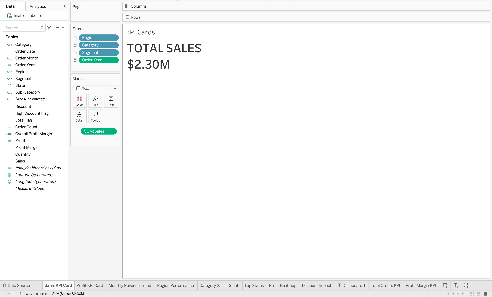
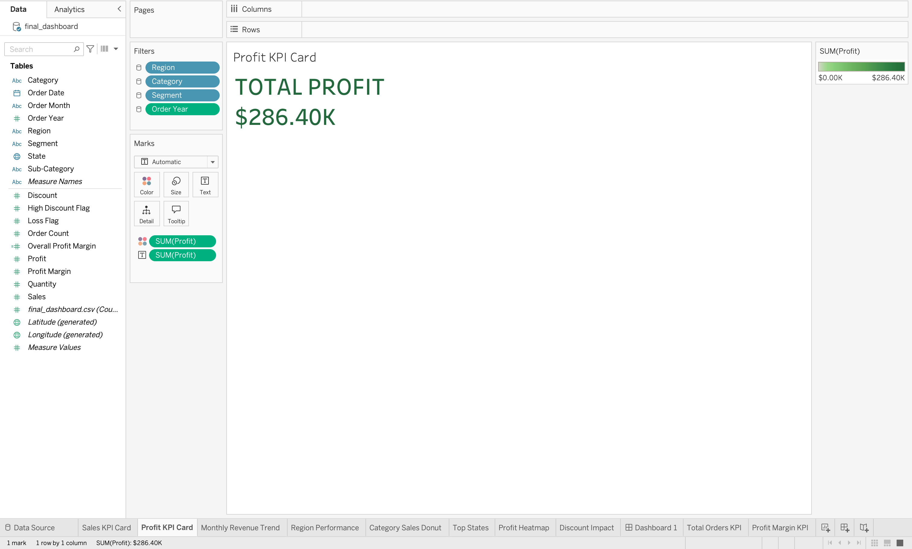
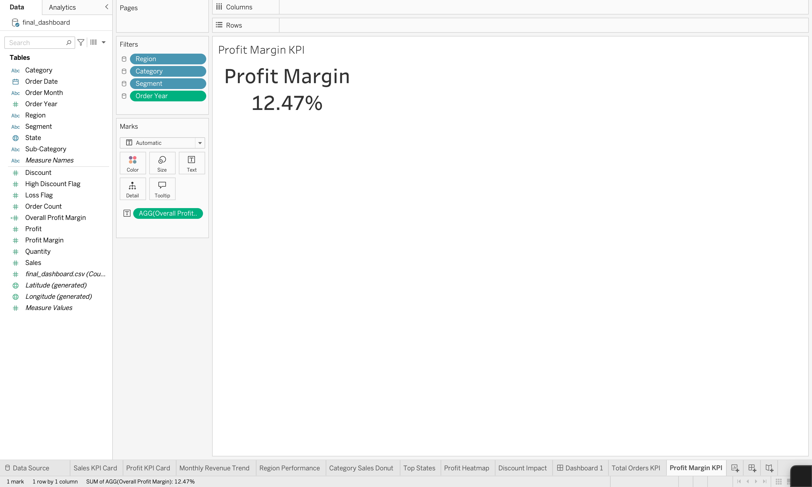
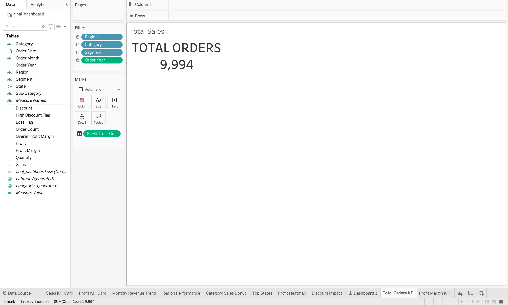
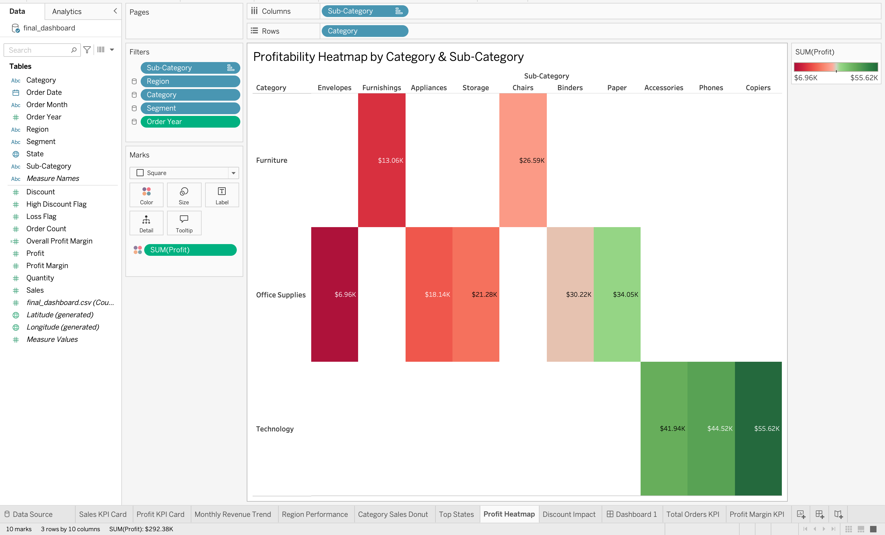
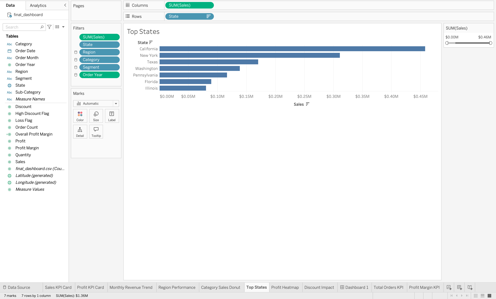
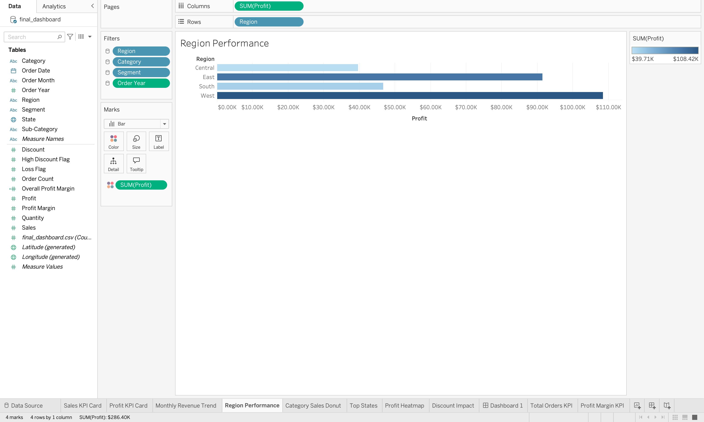
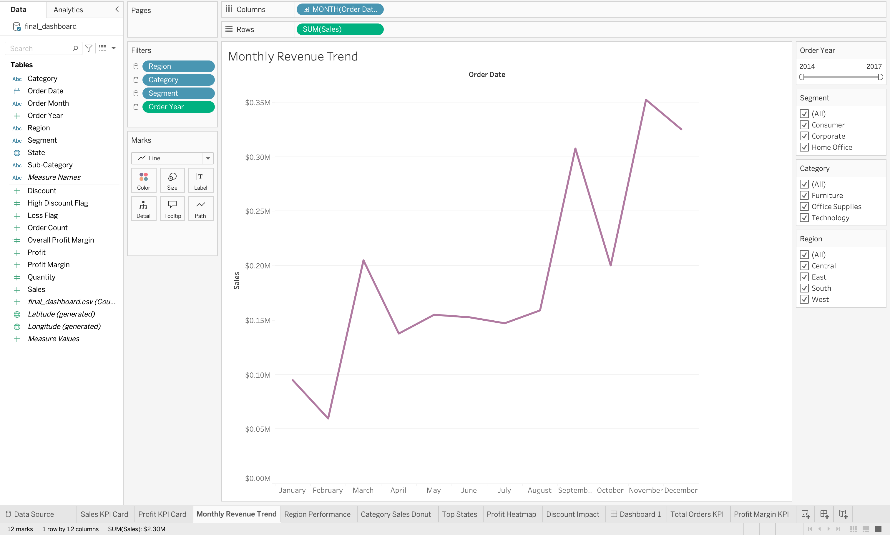
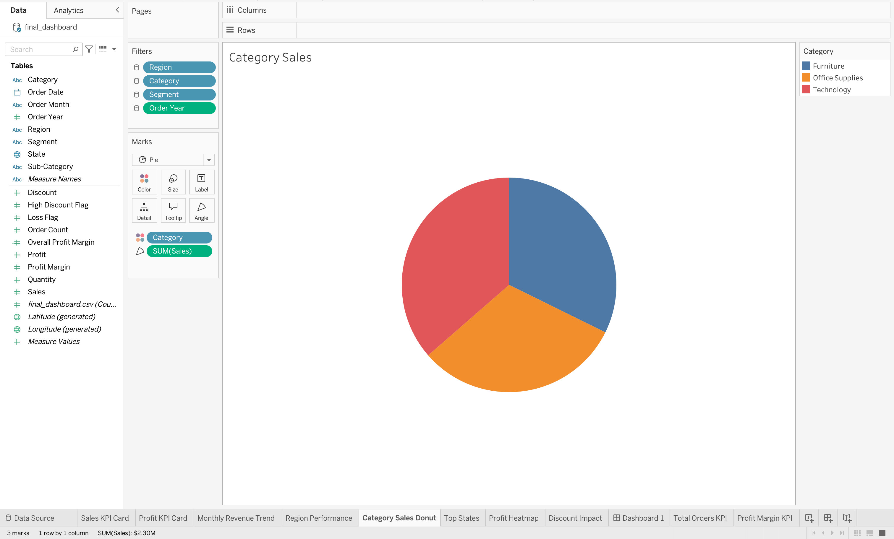
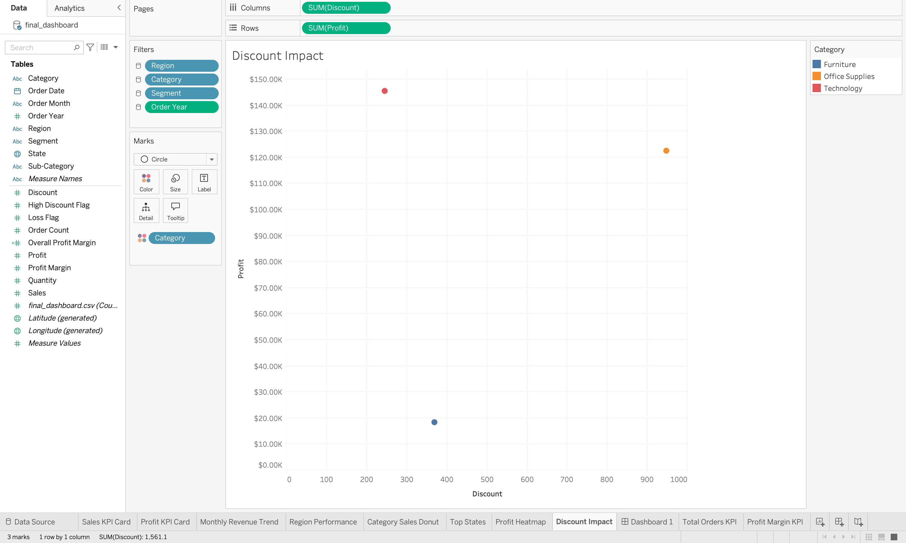

# 📊 Hopper Horizon Retail Sales Analytics

This document provides a step-by-step breakdown of the visual components and key insights from the Tableau dashboard.

---

## 1. Executive Summary Dashboard
The complete view combining all strategic insights, geographic performance, and high-level KPIs into a single, interactive pane.

---

## 2. High-Level Performance KPIs
These scorecards provide real-time tracking of the most critical top-line and bottom-line metrics for the retail business.

### Total Sales Revenue

### Total Net Profit

### Overall Profit Margin

### Total Orders Processed

---

## 3. Geographic Analysis
Understanding where the business is thriving and where it is facing profitability challenges.

### State-Level Profitability Heatmap
Provides a clear visual indication of "Profit Deserts" (states operating at a loss) versus high-yield regions.

### Top Performing States
A ranked breakdown of the states contributing the most to overall revenue.

### Region-by-Region Performance
Comparing the East, West, Central, and South regions to identify macro-level trends.

---

## 4. Product & Trend Analysis
Deep dives into the specific products driving revenue and the time periods when they sell best.

### Monthly Revenue Trends
Identifying seasonality, specifically highlighting the demand surges occurring in Q4 (holidays).

### Sales by Product Category
Comparing the performance of Furniture, Office Supplies, and Technology.

---

## 5. Statistical & Pricing Insights
Examining the impact of operational strategies on the bottom line.

### The Impact of Discounts on Profit
Visualizing the negative correlation between aggressive discounting and net profit margins, highlighting the need for threshold-based discounting.

